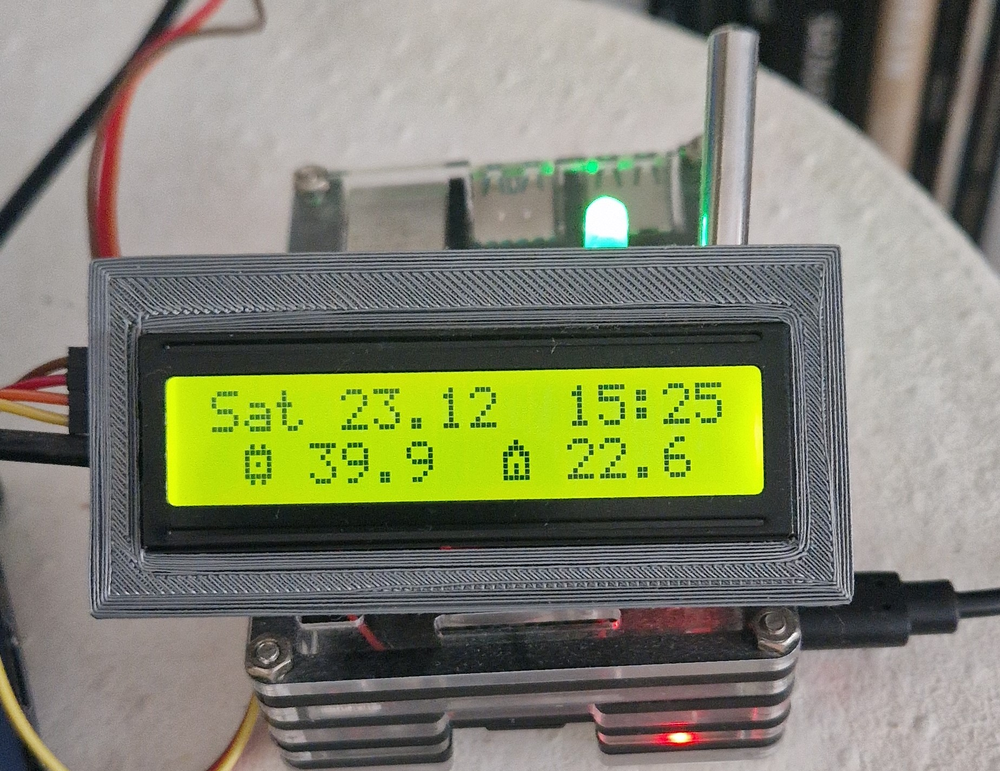

# LCD
This repository contains all the code for interfacing with a **16x2 character I2C liquid-crystal display (LCD)**. This accompanies my **Youtube tutorial**: [Raspberry Pi - Mini LCD Display Tutorial](https://www.youtube.com/watch?v=fR5XhHYzUK0).

<p align="center">
  <a href="https://www.youtube.com/watch?v=fR5XhHYzUK0">
    
  </a>
</p>

You can buy one of these great little I2C LCD on eBay or somewhere like [the Pi Hut](https://thepihut.com/search?type=product&q=lcd).

# Installation, implementation and contributions

Please refer to [Original repo LCD](https://github.com/the-raspberry-pi-guy/lcd)

I left the original repo in my fork for simplicity.

# Home Automation

I'm sorry for the length of the explanations. It’s a “big home automation project”. 

I separated it into 3 files to go step by step:
- ```demo_HApart1_temperature.py```
- ```demo_HApart2_now_playing.py```
- ```demo_HApart3_telegram.py```

This means that what you learn in ```demo_HApart1_temperature.py``` will be used in ```demo_HApart2_now_playing.py``` and ```demo_HApart2_now_playing.py``` in ```demo_HApart3_telegram.py```.
This project is above all a proof of concept. But by going step by step you will understand that you can modify it for your needs.

## Temperature

To get the CPU temperature it's not very complicated. Answers were given in the [Issues](https://github.com/the-raspberry-pi-guy/lcd/issues/58) of this GitHub Repo too.

On the other hand, to get the temperature of my house (especially my apartment), I used a DS18B20 thermal probe.

For the installation of the DS18B20 probe, I refer you to this [Tutorial](https://www.circuitbasics.com/raspberry-pi-ds18b20-temperature-sensor-tutorial/
). I followed it for the probe part. Then for the display on the LCD I used this GitHub repo.

If you followed the steps, the temperatures save to ``w1_slave``. In the script, change the path of ``temp_file`` depending on where your ``w1_slave`` is located

<p align="center">
  
</p>

## Now playing

For this step we will need to use the APIs.

APIs generally require a token and an ID. The "token" represents the instance that you will call to obtain the information and the ID is you. For security reasons I never write the token and ID directly in the code. You never know.


### For Spotify

### For Trakt
